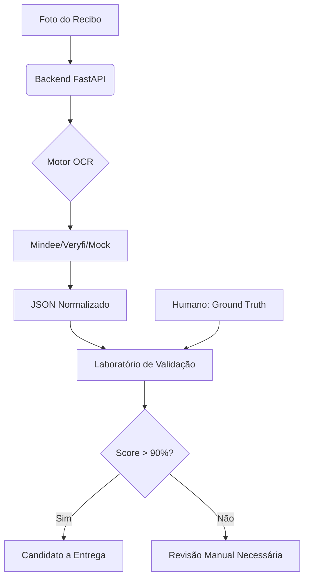

# 🧾 Laboratório de Validação OCR para Logística

> Um sistema inteligente para extração, normalização e validação de dados de recibos/notas fiscais focado em otimização de entregas.


Este projeto é um **Laboratório de Validação**, projetado para garantir que as informações extraídas de fotos de recibos (muitas vezes tortas ou com má iluminação) sejam 100% confiáveis antes de serem enviadas para o motor de roteirização logística.

---

## 🚀 Funcionalidades Principais

*   **📸 Ingestão Inteligente**: Upload de fotos de recibos via mobile/web.
*   **🤖 OCR Multi-Provedor**: Arquitetura pronta para conectar com Mindee, Veryfi, Azure Document Intelligence e AWS Textract.
*   **📐 Normalização de Dados**: Transforma retornos variados de APIs em um JSON padronizado e rigoroso.
*   **⚖️ Motor de Validação**:
    *   **Matemática**: Verifica se `quantidade × valor unitário = total`.
    *   **Lógica**: Valida CNPJ, datas e campos obrigatórios.
    *   **Fuzzy Matching**: Compara o texto extraído com a "Verdade de Referência" (Ground Truth).
*   **🖥️ Dashboard de Revisão**: Interface "lado a lado" para comparação visual e correção manual por humanos.
*   **🚚 Preparação Logística**: Apenas recibos com Score > 90% são convertidos em "Candidatos a Entrega".

---

## 🏗️ Arquitetura do Sistema



---

## 🛠️ Tecnologias Utilizadas

### Backend
*   **FastAPI**: Framework Python de alta performance.
*   **SQLAlchemy**: ORM para manipulação do banco de dados.
*   **Pydantic**: Validação de esquemas e dados.
*   **SQLite/PostgreSQL**: Armazenamento de extrações e métricas.

### Frontend
*   **Next.js 14**: Framework React para uma experiência de usuário fluida.
*   **Tailwind CSS**: Estilização moderna e responsiva.
*   **Lucide React**: Ícones elegantes para a interface.

---

## 📦 Como Instalar e Rodar

### 1. Requisitos Prévios
*   Python 3.10+
*   Node.js 18+
*   Git

### 2. Configurando o Backend
```bash
cd backend
python -m venv venv
# No Windows:
.\venv\Scripts\Activate.ps1
# No Linux/Mac:
source venv/bin/activate

pip install -r requirements.txt
uvicorn app.main:app --reload
```
*O backend estará rodando em `http://localhost:8000`*

### 3. Configurando o Frontend
```bash
cd frontend
npm install
npm run dev
```
*O dashboard estará disponível em `http://localhost:3000`*

---

## 📖 Como Usar o Sistema

1.  **Upload**: Vá na aba "Upload / Test" e envie uma foto de recibo.
2.  **Extração**: O sistema processará a imagem e mostrará o JSON estruturado gerado pela IA.
3.  **Revisão**: Na aba "Human Review", selecione o recibo.
4.  **Validação**: Insira no editor a "Verdade de Referência" (o que realmente está escrito no papel) e clique em **Validar**.
5.  **Score**: O sistema dará uma nota de 0 a 100. Se os dados forem confiáveis, o recibo será aprovado para a etapa de logística.

---

## 🗺️ Roadmap Futuro
- [ ] Integração nativa com Google Maps Geocoding API.
- [ ] Roteirização otimizada usando OSRM ou VROOM.
- [ ] App Mobile em Flutter para os motoristas.

---
Desenvolvido por [AraujoFran](https://github.com/araujofran) 🚀
